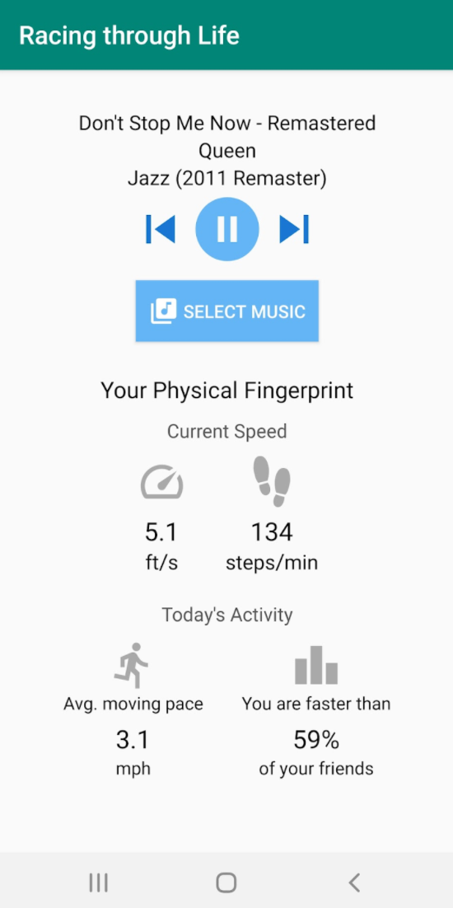

# Racing through Life

Prototype Android music player that speeds up your music based on how fast you're walking - capturing your physical fingerprint in an easily understandable and sharable form

Created for CMSC 23218: Surveillance Aesthetics at the University of Chicago (Fall 2021)

